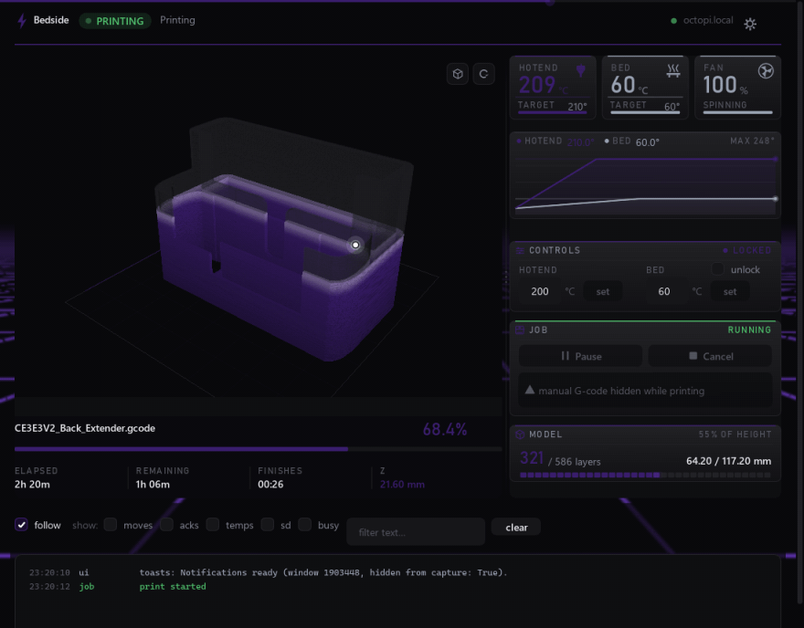

# Bedside

A desktop client for OctoPrint, built on
[VertexUI](https://github.com/D4ead3ye/vertexui) and Dear ImGui. Live
temperatures, job progress, a G-code terminal, and a GPU-rendered 3D
toolpath that fills in as the print actually happens.



<sub>Recorded with `tools/make_spotlight.py` — a real 3.8s loop of the app,
not a mock-up. [Still screenshot](docs/screenshot.png).</sub>

- **Real progress, not an estimate.** The 3D view is driven by the byte
  offset OctoPrint reports, bisected against the offsets recorded while
  parsing, so the boundary between printed and unprinted is the actual
  segment the nozzle is on.
- **A real renderer.** Every extrusion is a box with a depth buffer behind
  it — 1.4M vertices of the reference model at ~5ms a frame, with a
  cutaway for looking inside.
- **Safe by construction.** No jog controls at all, and motion G-code is
  refused on the send path, not just hidden in the UI.
- **Themed throughout.** Six shader backdrops, ten particle effects,
  four card styles, your own fonts and cue sounds, and every panel section
  switchable.
- Click-through toasts that report a finished print *over* a fullscreen
  game.

Everything visual, and every knob, is catalogued in
[docs/VISUALS.md](docs/VISUALS.md).

## Download

### [⬇ Bedside for Windows](https://github.com/D4ead3ye/bedside/releases/latest)

Unzip anywhere and run `Bedside.exe`. No Python, no installer, nothing
written outside the folder you unzipped it to and `%APPDATA%\bedside`.

Needs Windows 10/11 and a GPU with OpenGL 3.3. There is a CPU fallback for
the 3D view if that is missing, though the cutaway needs the GPU path.

### First launch

It asks for your printer's address — `192.168.1.50`, or `octopi.local`.
**Pair with OctoPrint** then starts the Application Keys handshake:
OctoPrint shows an authorisation prompt in its own web UI, you click Allow,
and the key arrives here. You never type or paste it anywhere. There is a
manual key box for older OctoPrint builds without the plugin.

Settings, saved themes and your own cue sounds live in `%APPDATA%\bedside`.

## Run from source

```bash
git clone https://github.com/D4ead3ye/bedside.git
cd bedside
python -m venv .venv
.venv\Scripts\python.exe -m pip install -r requirements.txt
.venv\Scripts\python.exe run.py
```

Python 3.11+. `requirements.txt` pulls VertexUI straight from its
repository — it is not on PyPI, and Bedside needs the `Toasts` `on_event`
hook from 1.2.0.

To build the exe yourself:

```bash
.venv\Scripts\python.exe -m PyInstaller --noconfirm Bedside.spec
```

The result is `dist/Bedside/Bedside.exe`. Run **that** one — the
`Bedside.exe` left in `build/` is an intermediate stub without its
`_internal` folder and fails with "Failed to load Python DLL".

### Keyboard

| | |
| --- | --- |
| `Esc` | back out of settings |
| `Ctrl` `,` | toggle settings |
| `F5` | reconnect |
| `F1` | about |

Nothing destructive is bound. Pause and cancel are deliberately not on a
key — one you can hit by accident must not be able to ruin a nine-hour
print.

## No jog controls

There are deliberately no jog or home buttons. Moving the head or the bed
during a print ruins it, and "disabled behind an unlock checkbox" is still
one mis-click away from doing exactly that — a dashboard you leave open for
nine hours is the wrong place for a control whose worst case is scrapping
the job. The printer's own LCD and the OctoPrint web UI both still have
them for when the machine is idle.

The manual G-code box is closed off the same way, in two layers:

1. It is **hidden entirely** while a job runs. A text box that accepts
   `G1 X0 Y0` is a jog control with extra steps.
2. `client.is_motion_command` refuses motion on the **send path** as well,
   so the guard does not depend on the box being invisible. The `printing`
   flag comes from the last socket push and can lag the printer by a frame;
   a check that lives only in the draw code can be raced by one.

Refused: `G0`-`G3`, `G10`/`G11`, `G28`, `G29`, `G92`, `M18`, `M84`. The last
three are not moves but belong on the list anyway — `G92` redefines the
origin, so every later coordinate in the running job lands somewhere else,
and `M18`/`M84` drop the steppers and let the head sag. Both scrap the print
as surely as a jog does.

Everything else still goes through while printing: `M117`, fan and
temperature commands, queries. When the printer is idle nothing is refused.

---

## More

- [docs/VISUALS.md](docs/VISUALS.md) — every visual feature and every knob
- [docs/ENGINEERING.md](docs/ENGINEERING.md) — the engineering log
- [VertexUI](https://github.com/D4ead3ye/vertexui) — the toolkit this is
  built on

MIT. See [LICENSE](LICENSE).
